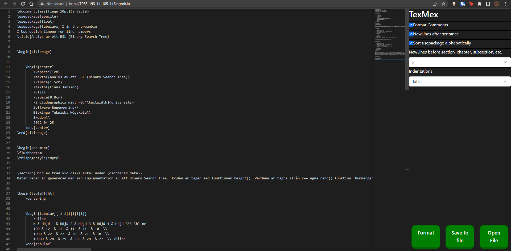

# texmex
A web-based LaTeX formatter / linter
[DEMO](https://texmex.linusjansson.com/)

## Features
* Formats comments
* Sorts usepackage alphabeticly
* Adds newline after each sentance to improve git support
* Adds newlines before sections and chapters to imporve readability
* Adds indentaton with tabs or spaces
## Running with docker
1. Clone the repo to a desired location
2. Build the image with `docker build . -t texmex:latest`
3. Run the image on port 8080 with `docker run -d -p 80:8080 texmex:latest`

